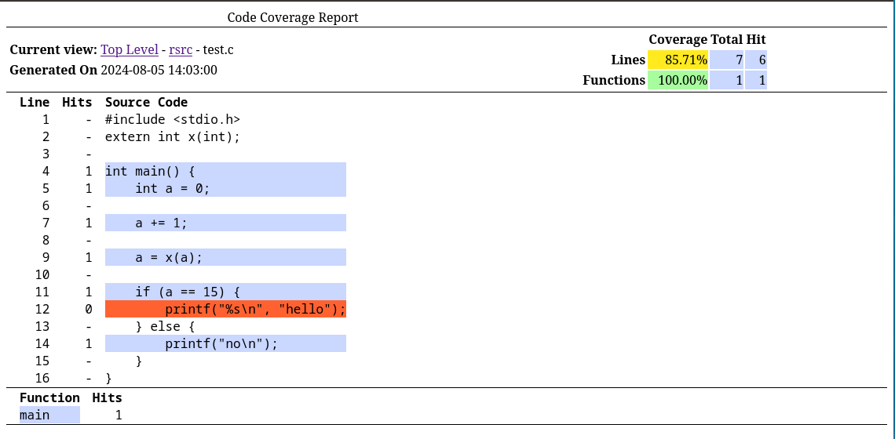

# LCOV2

This is an improved and more featureful library for working with LCOV coverage data.

## Features

* Read LCOV files
* Write LCOV files
* Edit LCOV files
* Convert LCOV files to HTML

## Future Features

* Merge LCOV files

## Screenshot

